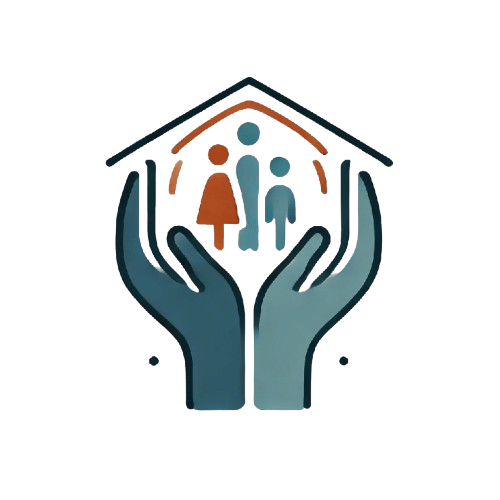

<a name="readme-top"></a>

<div align="center">

  
  
  # Refugee Haven


</div>

<!-- TABLE OF CONTENTS -->

## 📗 Table of Contents

- [📖 About the Project](#about-project)
  - [🛠 Built With](#built-with)
    - [Tech Stack](#tech-stack)
    - [Key Features](#key-features)
  - [🚀 Live Demo](#live-demo)
- [💻 Getting Started](#getting-started)
  - [Setup](#setup)
  - [Prerequisites](#prerequisites)
  - [Open](#open)
  - [Usage](#usage)
  <!-- - [Run tests](#run-tests) -->
  <!-- - [Deployment](#triangular_flag_on_post-deployment) -->
- [👥 Authors](#authors)
- [🔭 Future Features](#future-features)
- [🤝 Contributing](#contributing)
- [⭐️ Show your support](#support)
- [🙏 Acknowledgements](#acknowledgements)
- [❓ FAQ](#faq)
- [📝 License](#license)

<!-- PROJECT DESCRIPTION -->

## Refugee Haven Website <a name="about-project"></a>

>Refugee Haven is a compassionate, community-centered organization dedicated to empowering refugees and displaced individuals on their journey to rebuilding lives.

## 🛠 Built With <a name="built-with"></a>

### Tech Stack <a name="tech-stack"></a>


<details>
  <summary>Client</summary>
  <ul>
    <li>HTML</li>
    <li>CSS</li>
    <li>Tailwindcss</li>
    <li>React JS</li>
  </ul>
</details>

<details>
  <summary>Server</summary>
  <ul>
    <li>Not applicable</li>
  </ul>
</details>

<details>
<summary>Database</summary>
  <ul>
    <li>Not applicable</li>
  </ul>
</details>

<!-- Features -->

### Key Features <a name="key-features"></a>


- *CSS styling HTML structuring*
- *Tailwindcss styling React HTML structuring*
<!-- - **Linter Test** -->
<!-- - **ES6 and Modularization** -->

<p align="right">(<a href="#readme-top">back to top</a>)</p>

<!-- LIVE DEMO -->

## 🚀 Live Demo <a name="live-demo"></a>

- [Run the app](https://refugee-haven.vercel.app/)

<p align="right">(<a href="#readme-top">back to top</a>)</p>

<!-- GETTING STARTED -->

## 💻 Getting Started <a name="getting-started"></a>


To get a local, copy up and running, follow these steps.

### Prerequisites

In order to run this project, you need:
- Web browser
- Any IDE (Integrated Development Environment)
 ### Note: 
 Most of the commands here are for mac user or those using Terminal

<!-- ## Node required
Nod node required -->

### Setup

Clone this repository to your desired folder:


```sh
  cd my-folder
  git clone https://github.com/Ntihanabayo-Alphonse/Refugee-Haven.git
```

### Open

Open this project with:

```sh
  cd Refugee-Haven/
```

### Usage

- Run the project in any desired code editor.
- To open it with the browser; Run


```sh
    cd refugee-haven
    npm run dev
```
- The application is running on your localhost

<!-- ### Deployment

The project is deployed using:

```sh
github webpages
``` -->

<p align="right">(<a href="#readme-top">back to top</a>)</p>

<!-- AUTHORS -->

## 👥 Authors <a name="Ntihanabayo-Alphonse"></a>

> Mention all of the collaborators of this project.

:man_technologist:  **Ntihanabayo-Alphonse** :writing_hand: 

- GitHub: [githubhandle](https://github.com/Ntihanabayo-Alphonse)
- LinkedIn: [LinkedIn](https://www.linkedin.com/in/ntihanabayo-alphonse/) 


<p align="right">(<a href="#readme-top">back to top</a>)</p>

<!-- FUTURE FEATURES -->

### 🔭 Future Features <a name="future-features"></a>


- [ ] **Add your favorite movie to watchlist**
- [ ] **Watch movie trailers and full movie**


<p align="right">(<a href="#readme-top">back to top</a>)</p>

<!-- CONTRIBUTING -->

## 🤝 Contributing <a name="contributing"></a>

Contributions, issues, and feature requests are welcome!

<p align="right">(<a href="#readme-top">back to top</a>)</p>

<!-- SUPPORT -->

## ⭐️ Show your support <a name="support"></a>


If you like this project, show your support by giving a star ⭐️ to this project


<p align="right">(<a href="#readme-top">back to top</a>)</p>

<!-- ACKNOWLEDGEMENTS -->

## 🙏 Acknowledgments <a name="acknowledgements"></a>


I would like to thank all the contributors and code reviewers.

<p align="right">(<a href="#readme-top">back to top</a>)</p>

<!-- FAQ (optional) -->

## ❓ FAQ <a name="faq"></a>


- **How can I contribute to this project?**

  - Just clone the project and create a pull request with a well detailed feature intended to be added

<p align="right">(<a href="#readme-top">back to top</a>)</p>

<!-- LICENSE -->

## 📝 License <a name="license"></a>

This project is [MIT](./LICENSE) licensed.

_NOTE: we recommend using the [MIT license](https://choosealicense.com/licenses/mit/) - you can set it up quickly by [using templates available on GitHub](https://docs.github.com/en/communities/setting-up-your-project-for-healthy-contributions/adding-a-license-to-a-repository). The acknowledgement https://www.behance.net/gallery/29845175/CC-Global-Summit-2015._

<p align="right">(<a href="#readme-top">back to top</a>)</p>
